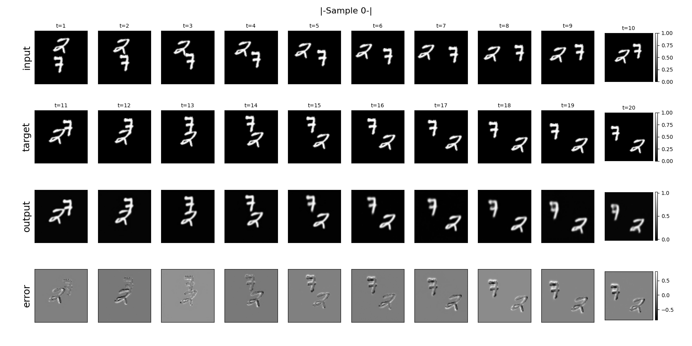
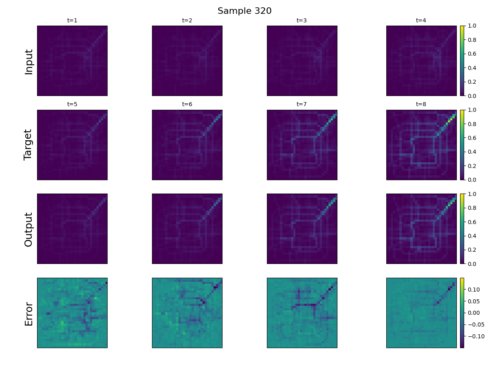

# STF

一个时空预测入门框架: 时空预测, 视频序列预测, 雷达回波外推... 

## 数据集
### MovingMNIST:
- 下载(bash)：sh "Dataset\Download\download_moving_mnist.sh"
- **模型配置与性能指标**:

#### 模型配置

| Model | Model Config |
|------|-------------|
| **PredRNN-V1** | input_channels=1, num_hidden_channels=[128,128,128,128], input_frames=10, output_frames=10, patch_size=4, kernel_size=5, reverse_scheduled_sampling=True |
| **PredRNN-V2** | input_channels=1, num_hidden_channels=[128,128,128,128], input_frames=10, output_frames=10, patch_size=4, kernel_size=5, reverse_scheduled_sampling=True |
| **UNet** | in_channels=1, out_channels=1, in_frames=10, out_frames=10, bilinear=True |
| **SmaAtUNet** | in_channels=1, out_channels=1, in_frames=10, out_frames=10, num_kernel=2, reduction_ratio=16 |
| **SimVP-V1** | input_shape=[10,1,64,64], translator_type=IncepU, hid_channels_S=64, hid_channels_T=512, layers_S=4, layers_T=8 |
| **SimVP-V2** | input_shape=[10,1,64,64], translator_type=gSTA, hid_channels_S=64, hid_channels_T=512, layers_S=4, layers_T=8 |
| **TAU** | input_shape=[10,1,64,64], translator_type=TAU, hid_channels_S=64, hid_channels_T=512, layers_S=4, layers_T=8 |
| **STLight** | in_channels=10, out_channels=10, hid_channels=1024, layers=16, patch_size=2 |

#### 性能指标

| Model | Params | MSE ↓ | MAE ↓ | RMSE ↓ | PSNR ↑ | SSIM ↑ |
|------|--------|-------|-------|--------|--------|--------|
| **PredRNN-V1** | 23.84M | 25.4224 | 76.9728 | 4.9976 | 22.9966 | 0.9251 |
| **PredRNN-V2** | 23.86M | 25.6829 | 77.4449 | 5.0228 | 22.9554 | 0.9264 |
| **UNet** | 17.27M | 50.973 | 127.98 | 7.121 | 19.7168 | 0.8576 |
| **SmaAtUNet** | 4.03M | 55.1125 | 137.735 | 7.407 | 19.3423 | 0.841 |
| **SimVP-V1** | 57.95M | 32.6546 | 89.7017 | 5.6823 | 21.7713 | 0.9133 |
| **SimVP-V2** | 46.77M | 27.2356 | 78.2131 | 5.1791 | 22.6811 | 0.9285 |
| **TAU** | 44.66M | 26.4949 | 76.8922 | 5.1083 | 22.8022 | 0.9304 |
| **STLight** | 17.89M | 23.1482 | 70.9686 | 4.7676 | 23.5775 | 0.9355 |

> 注: ↓表示越小越好，↑表示越大越好；所有模型仅训练了200个epoch，SimVP类型和UNet类型均未触发早停机制

### TaxiBJ:
- 下载(bash)：sh "Dataset\Download\download_taxibj.sh"
- **模型配置与性能指标**:

#### 模型配置

| Model | Model Config |
|------|-------------|
| **PredRNN-V1** | input_channels=2, num_hidden_channels=[128,128,128,128], input_frames=4, output_frames=4, patch_size=2, kernel_size=5, reverse_scheduled_sampling=False |
| **PredRNN-V2** | input_channels=2, num_hidden_channels=[128,128,128,128], input_frames=4, output_frames=4, patch_size=2, kernel_size=5, reverse_scheduled_sampling=True |
| **UNet** | in_channels=2, out_channels=2, in_frames=4, out_frames=4, bilinear=True |
| **SmaAtUNet** | in_channels=2, out_channels=2, in_frames=4, out_frames=4, num_kernel=2, reduction_ratio=16 |
| **SimVP-V1** | input_shape=[4,2,32,32], translator_type=IncepU, hid_channels_S=32, hid_channels_T=256, layers_S=2, layers_T=8 |
| **SimVP-V2** | input_shape=[4,2,32,32], translator_type=gSTA, hid_channels_S=32, hid_channels_T=256, layers_S=2, layers_T=8 |
| **TAU** | input_shape=[4,2,32,32], translator_type=TAU, hid_channels_S=32, hid_channels_T=256, layers_S=2, layers_T=8 |
| **STLight** | in_channels=8, out_channels=8, hid_channels=256, layers=16, patch_size=1 |

#### 性能指标

| Model | Params | MSE ↓ | MAE ↓ | RMSE ↓ | PSNR ↑ | SSIM ↑ |
|------|--------|-------|-------|--------|--------|--------|
| **PredRNN-V1** | 23.66M | 0.3276 | 15.1447 | 0.5344 | 39.6018 | 0.9772 |
| **PredRNN-V2** | 23.67M | 0.3654 | 15.29 | 0.5453 | 39.5338 | 0.9764 |
| **UNet** | 17.27M | 0.3518 | 15.7073 | 0.5444 | 39.3579 | 0.9766 |
| **SmaAtUNet** | 4.03M | 0.3798 | 16.3223 | 0.5657 | 39.0235 | 0.9736 |
| **SimVP-V1** | 13.79M | 0.3229 | 15.3546 | 0.5342 | 39.5185 | 0.9766 |
| **SimVP-V2** | 6.08M | 0.3026 | 14.8174 | 0.5182 | 39.7826 | 0.9790 |
| **TAU** | 5.66M | 0.3003 | 15.0326 | 0.5198 | 39.7168 | 0.9787 |
| **STLight** | 1.32M | 0.3338 | 15.319 | 0.5328 | 39.5448 | 0.9774 |

> 注: ↓表示越小越好，↑表示越大越好

### SEVIR:
- 运行download_sevir_vil.sh脚本之前, 请确保已安装AWS CLI: https://docs.aws.amazon.com/zh_cn/cli/latest/userguide/getting-started-install.html
- 下载(bash): sh "Dataset\Download\download_sevir_vil.sh"
- SEVIR数据处理可移步: https://github.com/ziheng1027/SEVIR/tree/main

## 模型
- ConvLSTM*(NIPS 2015)
- PredRNN(V1:NIPS 2017, V2:IEEE 2022)
- PhyDNet(CVPR 2020)
- UNet(CVPR 2015)
- SmaAtUNet(PRL 2021)
- SimVP(IncepU:CVPR 2022, gSTA:IEEE 2022, TAU:CVPR 2023)
- STLight(WACV 2024)

## 环境依赖
python>=3.12, cuda>=12.x, pytorch>=2.6.0  
1. pip3 install torch torchvision --index-url https://download.pytorch.org/whl/cu128  
2. pip install -r requirements.txt  

## 运行说明
- Config目录包含模型配置文件(以数据集名称组织), 数据集配置文件以及指标配置文件(不同数据集可选择不同指标)
- 配置完成后, 在main脚本中指定model_name, dataset_name, mode=train开始训练
- 训练完成后, 打开Config中的模型配置文件, 将训练好的模型文件路径填入model_path, 然后在main脚本中选择mode=test开始测试
- test时可指定save_interval来规定样本保存间隔, test后可选择mode=visualize来可视化已保存的样本
- 输出统一存放在Output目录下, 包含训练完成的最佳模型文件, 训练日志, 训练损失曲线, 测试样本, 可视化等内容
- 参数说明: 
    - patience: 早停耐心值, 当超过多少个epoch没有提升时停止训练
    - resume_from: 断点续训, 意外中断训练时, 将当前最新的模型路径填入可以重新接着训练
    - model_path: 模型路径, 用于test模式测试指定模型的性能指标
    - save_interval: test模式下样本保存的间隔